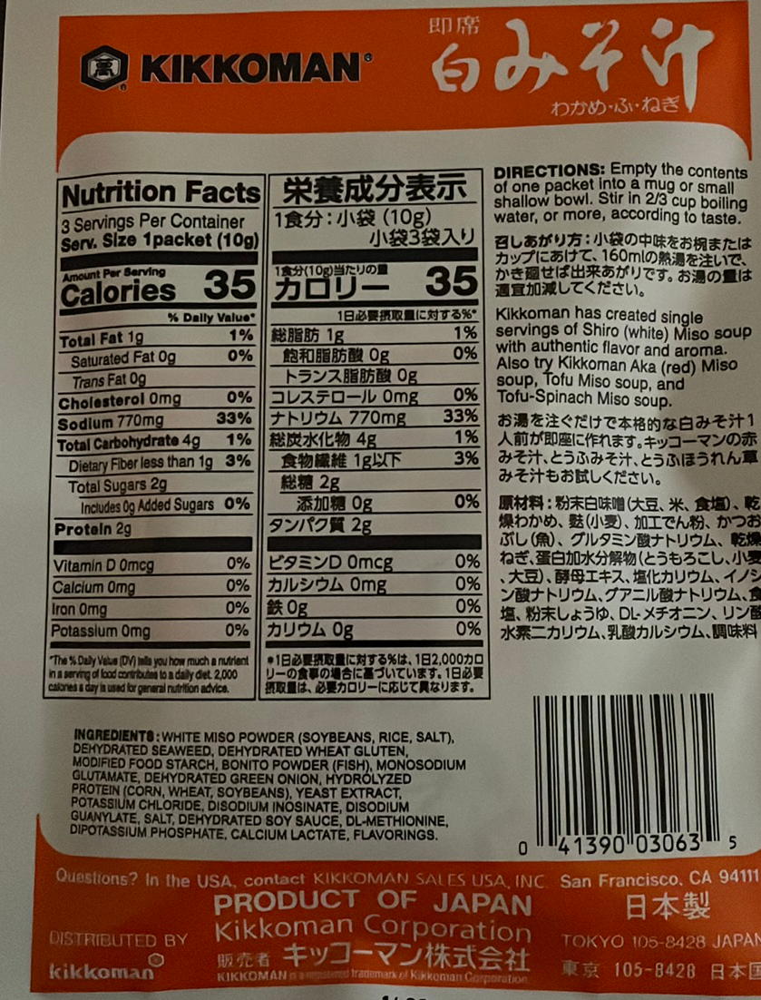
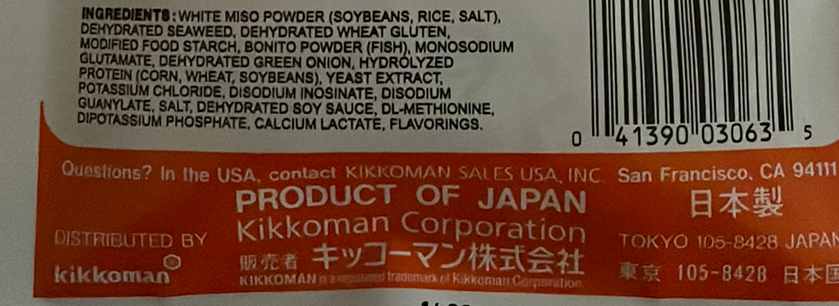

<div align="center" markdown="1">


<br/>

# Flask OCR Back-end


</div>

This server-side application is the back-end to a mobile application providing Optical Character Recognition (OCR) image processing. This machine learning technology enables the application to read the text found within an image uploaded to the API and returns a JSON response with the text discovered via OCR analysis.

<div align="center">


</div>

---

This application has been developed to enable custom data extraction. With this feature it will search an uploaded image for any keyword or arrangement of characters, and if found, the application will auto-crop the image file to the region of interest and return an OCR analysis filtered to this area.

---

Example: Image uploaded to the API with keyword "ingredients"

|                                       Before                                       |                                      After                                       |
| :--------------------------------------------------------------------------------: | :------------------------------------------------------------------------------: |
|  |  |

---

Example: JSON response from image uploaded to the API with keyword "ingredients"

```
[
"INGREDIENTS : WHITE MISO POWDER (SOYBEANS, RICE, SALT),",
"DEHYDRATED SEAWEED, DEHYDRATED WHEAT GLUTEN,",
"MODIFIED FOOD STARCH, BONITO POWDER (FISH), MONOSODIUM",
"GLUTAMATE, DEHYDRATED GREEN ONION, HYDROLYZED",
"PROTEIN (CORN, WHEAT, SOYBEANS), YEAST EXTRACT,",
"POTASSIUM CHLORIDE, DISODIUM INOSINATE, DISODIUM",
"GUANYLATE, SALT, DEHYDRATED SOY SAUCE, DL-METHIONINE,",
"DIPOTASSIUM PHOSPHATE, CALCIUM LACTATE, FLAVORINGS.",
"0 41390 03063 5",
"Questions? In the USA, contact KIKKOMAN SALES USA, INC. San Francisco, CA 94111",
"PRODUCT OF JAPAN",
"Kikkoman Corporation",
"日本製",
"DISTRIBUTED BY",
"販売者 キッコーマン株式会社",
"TOKYO 105-8428 JAPAN",
"kikkoman",
"KIKKOMAN & a mastered trademark of Kikkoman Corporation",
"東京 105-8428 日本国"
]
```
---

## Project Details

- Developed with Python version 3.9 and Flask micro-framework
- Automated image cropping to a region of interest via text recognition
- Image preprocessing via OpenCV
- Utilizes Azure Computer Vision and Google Vision APIs
- Image files via requests are stored locally to the application
- Deployed to [Heroku](https://www.heroku.com/)

---

## Deployed URL for API services

- https://computer-vision-api.herokuapp.com/{endpoint}

---

## API References

For general use a preprocessing level of 0 for API calls will be the most effective

- URL: https://computer-vision-api.herokuapp.com/ocr/azure-read

  - Method: POST
  - Body:
    - image: {_the image file_}
    - preprocessing: {_a number from 0 - 4_}
    - search: {_the character arrangement to search for, will crop the uploaded image and provide a response from the region of interest_}
    - ##### _The search parameter is required, but can be left empty_
  - Response: OCR Analysis via Azure Read v3.0 API
  - Average Result: ⭐ ⭐ ⭐ ⭐

---

- URL: https://computer-vision-api.herokuapp.com/ocr/azure

  - Method: POST
  - Body:
    - image: {_the image file_}
    - preprocessing: {_a number from 0 - 4_}
    - search: {_the character arrangement to search for, will crop the uploaded image and provide a response from the region of interest_}
    - ##### _The search parameter is required, but can be left empty_
  - Response: OCR Analysis via Azure OCR v2.1 API
  - Average Result: ⭐ ⭐

---

- URL: https://computer-vision-api.herokuapp.com/ocr/vision

  - Method: POST
  - Body:
    - image: {_the image file_}
    - preprocessing: {_a number from 0 - 4_}
    - search: {_the character arrangement to search for, will crop the uploaded image and provide a response from the region of interest_}
    - ##### _The search parameter is required, but can be left empty_
  - Response: OCR Analysis via Google Vision API
  - Average Result: ⭐ ⭐ ⭐ ⭐

---

- URL: https://computer-vision-api.herokuapp.com/ocr/sift-contour

  - Method: POST
  - Body: image: _the image file_
  - Response: Successful if the contours of a largest bounding box are discovered to be contained within the images maximum width. Returns an image file auto-cropped to the region of interest.

---

## Getting Started

- Ensure Python is installed locally on your machine
- To initialize a virtual enviroment, navigate to the directory of the application in the terminal and execute:

  ##### _Note: "python3" will depend on your version of Python_

  ```
  $ python3 -m venv venv
  ```

- Activate the virtual environment:

  ```
  $ source venv/bin/activate
  ```

- Install dependencies:

  ```
  $ pip3 install -r requirements.txt
  ```

---

## Run the Development Server

- Navigate to the project in the terminal and activate the virtual environment:

  ```
  $ source venv/bin/activate
  ```

- Run the development server from the 'src' directory:

  ```
  $ flask run
  ```

---

### This application utilizes a .env file to host environment variables. For utilization configure the following keys:

- #### AZURE_SUBSCRIPTION_KEY (for Azure Read)
- #### AZURE_SUBSCRIPTION_KEY_2 (for Azure OCR v2.0)
- #### AZURE_ENDPOINT
- #### FLASK_ENV=development (or FLASK_ENV=production)

### In addition, this application utilizes a ServiceToken.json provided via Google Vision

---
